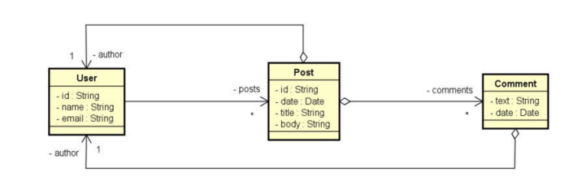

# Project with SpringBoot & MongoDB
 

# Sobre o projeto

Projeto simples para aprendizado da utilização do Java com o framework Springboot e o banco MongoDB.

## Domain Model

# Tecnologias utilizadas
## Back end
- Java
- Spring Boot
- Maven
- MongoDB

# Autor

Vinícius Cunha dos Santos

linkedin.com/in/viniciuscunhasts/
